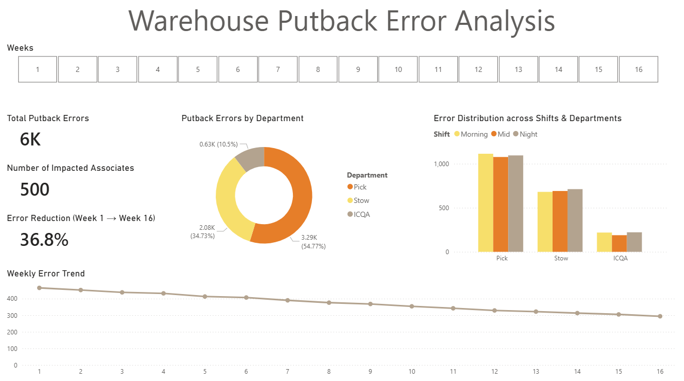

# Putback Error Analysis
## Operational Data Analysis using SQL and Power BI (Based on Amazon MME1 experience)

## Project Overview
When picking or stowing inventory in an Amazon Fulfillment Center, operational defects known as "Putback Errors" can occur if an item leaves its designated bin and is placed back into an incorrect location. As an ICQA Team Lead monitoring quality metrics daily, I noted that these errors created significant operational friction.

When a Picker cannot find an item, the system must route a different Pod to the station, delaying the process. Furthermore, the system automatically triggers an audit, sending the physical Pod to the ICQA department to locate the misplaced item, which consumes labor hours.

I developed this project to analyze historical quality logs, identify which departments and shifts drive the highest defect rates, and isolate targeted data to support floor management in associate retraining.

*Note on Data Privacy & Portfolio Dataset:* Due to NDA and strict data privacy rules at Amazon, I cannot share the original operational datasets. To demonstrate my technical skills, I used a simulated dataset of 6,000 generated cases that mirrors the logic, categories, and patterns of the real-world problem.

*Real-World Impact:* While the project documentation and dashboard use simulated data for display purposes, the actual process I implemented on the floor led to measurable improvements. In my original role, I executed this workflow manually using Excel and Pivot Tables. By extracting the data weekly, I generated "Top 10 Offender" lists for each shift and department, allowing Area Managers to conduct precise coaching at the start of their shifts. I collaborated with Pick, Stow, and ICQA teams to create department-specific training videos focused on preventing common Putback Errors. I defined the operational scenarios and key error points to be addressed, while the final video editing was completed with support from the team.

This continuous improvement process contributed to an approximately 30% reduction in Putback Errors during the improvement period.

---

## Tools Used & Skills Demonstrated

### SQL (MySQL Database Engine)
* **Database Design:** Table structure design for staging raw operational data.
* **Data Quality Assurance:** Validating row counts, scanning for NULL values, and verifying categorical consistency.
* **Data Aggregation & Filtering:** Using `GROUP BY`, multi-dimensional sorting, and `LIMIT` clauses to isolate high-priority operational targets.

### Power BI Desktop
* **Data Modeling:** Connecting operational database engines directly to reporting models.
* **UI/UX Best Practices:** Ensuring data privacy by separating high-level management trends from granular associate identifiers.
* **Honest Data Presentation:** Customizing chart elements (e.g., hardcoding the Y-axis minimum to 0) to prevent visual trend manipulation.

---

## Key Findings from the 6,000 Analyzed Cases
Out of the 6,000 total Putback error cases tracked over a 16-week period, the analysis revealed the following distinct patterns:

* **Department Distribution:** The Pick department is the primary driver of defects, accounting for **54.77%** of total errors (3.29K cases). Stow follows with **34.73%** (2.08K cases), while ICQA maintains the lowest error share at **10.50%** (0.63K cases). This lower rate reflects ICQA’s structural mandate focused on error correction and quality auditing.
* **Shift Multi-Dimension:** When cross-referencing departments with shifts (Morning, Mid, Night), the errors are distributed almost perfectly evenly (~18% of the total volume for each shift within the Pick department). This consistency across all teams indicates that Putback errors stem from a systemic process issue rather than a specific shift performance problem.
* **Temporal Performance:** The historical trend line demonstrates a steady, continuous downward trajectory, dropping from 465 errors in Week 1 to 294 errors in Week 16. This indicates an overall **36.8% reduction** in error volume over the course of the tracking period.

---

## Practical Recommendations & Real-World Implementation
The SQL script contains the foundational architecture used to drive weekly quality improvements on the warehouse floor:

* **Target Identification:** The SQL queries extract the top 10 associates with the highest recorded error counts for every department-shift combination. This supports managers by providing measurable data points for targeted coaching discussions.
* **Data-Driven Floor Coaching:** These targeted lists are provided directly to floor Area Managers. This data enables them to conduct immediate, factual coaching with the relevant associates, eliminating subjective assessments.
* **Root-Cause Visual Training:** To support the data-driven coaching, localized educational videos were introduced for the specific workflows of each department, showing associates exactly how these errors occur and how to prevent them.
* **Maintaining Data Privacy:** The executive dashboard focuses strictly on macro operational trends. Associate-level information (`Associate_ID`) is intentionally separated from management-level reporting to maintain strict data privacy while still enabling floor-level quality improvement analysis.

---

## Dashboard Preview

---

## Files Included
* **`putback_error_analysis.sql`**
  * Includes Database Setup, Data Quality/QA checks, Department/Shift business queries, and the Weekly Top 10 Offender scripts.
* **`putbeck_error_analysis_dashboard.pbix`**
  * The Power BI Dashboard file built to present the executive overview, featuring the KPI summary cards, department donut charts, shift column charts, and the 16-week historical trendline.
